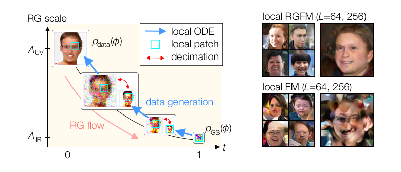

# Renormalization Group Flow Matching for Scalable Local Generative Modeling



Implementation of [Renormalization Group Flow Matching for Scalable Local Generative Modeling](https://arxiv.org/abs/xxxxx) by Kanta Masuki and Yuto Ashida.

Renormalization group flow matching (RGFM) is a generative modeling framework based on the exact renormalization group that leverages the multiscale structures inherent in natural data. By exploiting the scale-separation property and quasi-locality of the renormalization group (RG), the RGFM enables local generative modeling that is scalable with respect to the system size $L$.

In this GitHub repository, we provide the Python code used for the numerical experiments presented in the paper. For detailed usage instructions, please refer to the README files in `./1d_ising/`, `./1d_conditionally_local/`, and `./2d_image/`. respectively.

Please contact kmasuki@g.ecc.u-tokyo.ac.jp with any comments or issues regarding this repository.

The citation key of our work is
```
@misc{KY2026rgfm,
      title={Renormalization Group Flow Matching for Scalable Local Generative Modeling}, 
      author={Kanta Masuki and Yuto Ashida},
      year={2026},
      eprint={2601.xxxxx},
      archivePrefix={arXiv},
}
```
